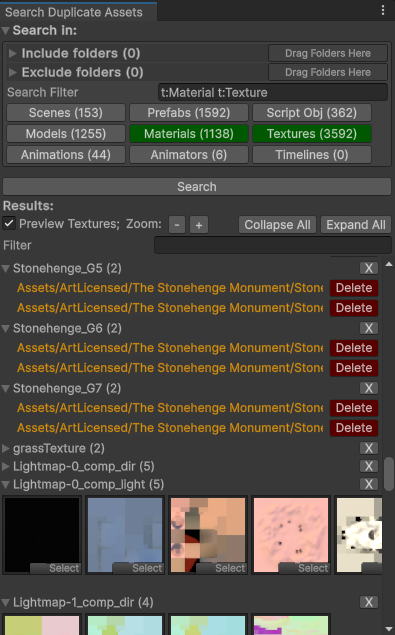
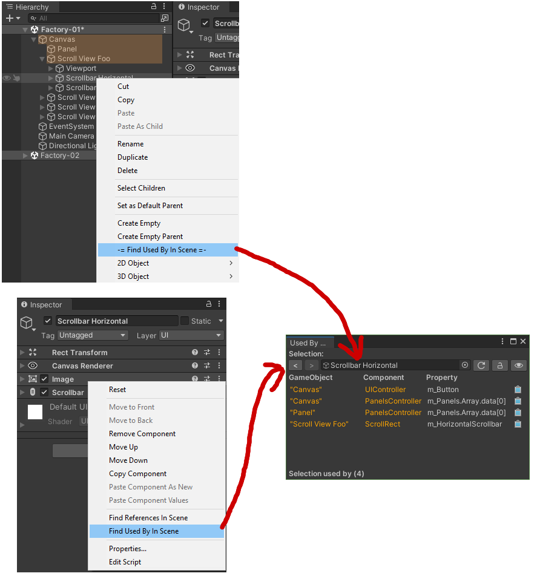

# Asset Management Tools for Unity
Small collection of tools for Unity used to manage your assets. Part of the [DevLocker](https://github.com/NibbleByte/DevLocker) project.

[Asset Store - MultiRename Tool](https://assetstore.unity.com/packages/tools/utilities/multi-rename-tool-170616) | [Asset Store - Scenes In Project](https://assetstore.unity.com/packages/tools/utilities/scenes-in-project-169933) | [OpenUPM](https://openupm.com/packages/devlocker.tools.assetmanagement/)

[](https://openupm.com/packages/devlocker.tools.assetmanagement/)

## List of Tools
* [Scenes In Project](#scenes-in-project) *(the star of this project)*
* [MultiRename Tool](#multirename-tool)
* [Search Duplicate Assets](#search-duplicate-assets)
* [Search References Fast!](#search-references-fast) *(discontinued)*
* [Search Prefabs Components](#search-prefabs-components)

## Installation
* Asset Store plugin: 
  * [Scenes In Project](https://assetstore.unity.com/packages/tools/utilities/scenes-in-project-169933)
  * [MultiRename Tool](https://assetstore.unity.com/packages/tools/utilities/multi-rename-tool-170616)
* [OpenUPM](https://openupm.com/packages/devlocker.tools.assetmanagement/) support:
```
npm install -g openupm-cli
openupm add devlocker.tools.assetmanagement
```
* Github upm package - merge this to your `Packages/manifest.json`
```
{
  "dependencies": {
    "devlocker.tools.assetmanagement": "https://github.com/NibbleByte/UnityAssetManagementTools.git#upm"
}
```

## Usage
All these tools can be found in the menus: "Tools/Asset Management/..."

## Scenes In Project

List of all available scenes in the project for quick access.<br />
Useful when you have to switch often between scenes in larger projects.

### Features:
* **List all scenes in project. Pin favourites at the top.**
* **"►" button per scene to run in play mode directly.**
* **"+" button per scene to add / remove additively.**
* Sort scenes by name, path, date, file size, or just drag them around.
* Scenes are grouped by folder. Groups are separated by little space.
* Customize how scenes are displayed.
* Color-code scenes by path or name.
* Multiple windows support (they all show the same though).
* Tested on a project with 1k+ scenes.
* Personal VS Project preferences. 
  * Personal preferences stored locally in the Library folder.
  * Project preferences to be shared with your team stored in the ProjectSettings folder.

## MultiRename Tool

Mass search and rename assets or scene game objects.

### Features:
* Live referesh on results when changing the initial parameters.
* Search pattern can contain "\d" to match any numbers.
* Replace pattern can contain "\d" to insert number (counter).
  * Can configure numbers start and step value + leading zeroes.
* Can tweak the final name before executing the rename.
* Can search recursively in folders, subassets or scene objects hierarchies.
* Disable Search or Replace pattern to match / replace everything.
<br />
<br />
<br />
<br />

## Search Duplicate Assets
Searches the project for duplicate assets (compares files by name only).

### Features:
* Displays duplicates in a grouped list.
* Textures are displayed as images in a single row for easy comparison.
* Can specify what asset types to search for.



## Search Prefabs Components

Search selected or all prefabs in the project if they have the specified components attached.

### Features:
* Type in component names to search for. Works with user and built-in components.
* Supports '&', '|', '!' *(and, or, not)* expressions for more complex queries.
* Results list displays what GameObjects in the prefab have these components.
* Can place all or individual result prefabs in the scene for quick inspection / tweaking. Can quickly remove them when done.

## Search References Fast!
Search what assets in the project refer directly to the selected ones.<br />
It gets the target GUIDs and performs text search in all project assets without actually loading them. <br />
This is very fast for searching prefabs references in scenes as it wouldn't load the scenes themselves. <br />

**NOTE: This tool requires your project to have "Assets Serialization Mode" set to "Force Text" in the project settings.**

**Discontinued: there are much better tools out there that offer better features, UX and support. This tool was uploaded here for historical reasons.**

### Features:
* Can search for sub assets (GUID + localId)
* Can search text directly (instead of selected asset GUIDs).
* Select what types of assets to search in. Can include / exclude meta files as well.
* Replace prefab instances in found scenes with another or just remove them.
* Select the assets in the result by type.
* Doesn't load assets (especially scenes which is slow).

### Issues & Drawbacks:
* Project needs to have "Assets Serialization Mode" set to "Force Text"
* Doesn't work with nested prefabs.
* No cache. Every search is done from scratch.
* No recursive mode - search direct references only.
* If result has multiple sub assets, it wouldn't show you which one references the target.

### Example:
In the screenshot below:
* "Bullet" prefab is referenced by the "TankShoot" animation.
* The "Car" prefab is referenced by 3 scenes.
* The "Tank" prefab is referenced by another 3 scenes.
* "Car" and "Tank" prefab can be replaced or removed in the found scenes with another using the last field.


## Find References In Scene
Search references to specified GameObject or **component** in the current scene (or prefab edit stage).
Open by right click on GameObject and selecting "Find References In Scene". You can additionally drag in any **component** as well.
